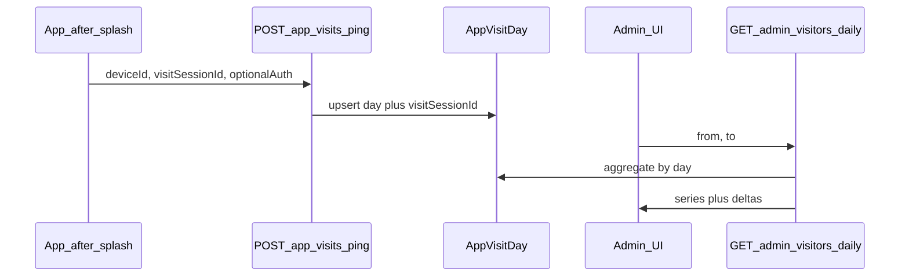

# Visitors Report (daily unique visitors, visits, day comparison)

## Context

- There is **no app-wide visit tracking** today. Product views (`ProductViewEvent`) and search analytics are separate domains.
- **Reuse**: [`frontend/src/pages/AdminSearchAnalyticsPage.js`](frontend/src/pages/AdminSearchAnalyticsPage.js) (date range, Recharts, `adminAPI`), [`routes/admin.js`](routes/admin.js) (`protect` + `requireDataEntry`), [`frontend/src/utils/deviceId.js`](frontend/src/utils/deviceId.js) for a stable anonymous id.
- **Definitions** (recommended and easy to explain in the UI):
  - **Unique visitors (daily)**: distinct **visitor key** per calendar day — `user:<mongoUserId>` if JWT present, else `device:<deviceId>`, else `anon:<sessionId>` (last resort if no device id).
  - **Visits (daily)**: count of **first app open per session per day** — one stored row per `(visitSessionId, day)` so multiple tabs = multiple visits, same person same device same day = one unique visitor (unless they use two keys; acceptable for MVP).

## Backend

1. **Model** — e.g. [`models/AppVisitDay.js`](models/AppVisitDay.js) (name flexible):
   - Fields: `day` (string `YYYY-MM-DD` in chosen timezone), `visitSessionId` (string from client, e.g. `sessionStorage`), `visitorKey` (string), optional `userId` (ObjectId ref), `deviceId` (string), `createdAt`.
   - **Unique compound index**: `{ day: 1, visitSessionId: 1 }` — upsert on ping so each session contributes at most one row per day.
   - Register in [`server.js`](server.js) / wherever models are loaded (match existing pattern).

2. **Ingestion** — e.g. `POST /api/app-visits/ping`:
   - Use **`optionalAuth`** (same as [`routes/ownerAnalytics.js`](routes/ownerAnalytics.js)) so `req.userId` is set when logged in.
   - Body: `deviceId`, `visitSessionId` (required), optional `clientDay` if you want client-side day alignment (usually better to compute day on server from `req` + fixed timezone).
   - Handler: build `visitorKey` from user > device > anon; derive `day` string; `updateOne({ day, visitSessionId }, { $setOnInsert: { visitorKey, userId, deviceId, createdAt } }, { upsert: true })`.
   - Rate-limit lightly if available; otherwise rely on unique index + idempotent upsert.

3. **Admin API** — under [`routes/admin.js`](routes/admin.js), same guards as search analytics:
   - `GET /api/admin/visitors-report/daily?from=YYYY-MM-DD&to=YYYY-MM-DD`
   - Aggregation: group by `day` → visits count, unique visitors via `$addToSet` + `$size` on `visitorKey`.
   - **Comparison**: **day-over-day** for each day in range (previous calendar day metrics + delta %).

**Timezone**: Bucketing `day` in **UTC** is simplest; if Iraq-focused, use `Asia/Baghdad` consistently in the controller when formatting `day`.

## Frontend

1. **Client ping** — after splash completes in [`frontend/src/App.js`](frontend/src/App.js): `useEffect` when `splashFinished === true`, `visitSessionId` from `sessionStorage`, `deviceId`, `POST /api/app-visits/ping`. Fail silently.

2. **API helpers** — add `adminAPI.getVisitorsReportDaily` and `appVisits.ping` in [`frontend/src/services/api.js`](frontend/src/services/api.js).

3. **Admin page** — [`frontend/src/pages/AdminVisitorsReportPage.js`](frontend/src/pages/AdminVisitorsReportPage.js) (patterns from Search Analytics). Route `/admin/visitors` in [`frontend/src/App.js`](frontend/src/App.js).

4. **Admin hub link** — optional entry on [`frontend/src/pages/AdminPage.js`](frontend/src/pages/AdminPage.js) (if you keep a card list there).

5. **Profile page (admin) — required placement** — In [`frontend/src/pages/ProfilePage.js`](frontend/src/pages/ProfilePage.js), inside `{isAdmin && ( <> ... )}` within the `showDataEntryLink` block (same section as Customization, Users, etc.), add a **`ListItemButton`** to `/admin/visitors` **immediately after** the existing **Users** row (after the `ListItemButton` whose primary text is `t("Users")`, ~lines 448–453) and **before** Translations. Use an icon consistent with analytics (e.g. MUI `BarChart` or `Analytics`) and a new i18n key such as `Visitors report`. Only visible when `isAdmin` is true (same condition as Users).

6. **i18n** — strings in [`frontend/src/i18nResources.js`](frontend/src/i18nResources.js) for the report page and the Profile menu label.

## Flow (mermaid)

## Implementation todos

- [ ] Add AppVisitDay model, POST `/api/app-visits/ping` with optionalAuth + upsert index
- [ ] Add GET `/api/admin/visitors-report/daily` with aggregation + day-over-day deltas
- [ ] Ping after splash; `adminAPI` + `AdminVisitorsReportPage` + route + i18n
- [ ] **ProfilePage**: admin-only link under Users (after Users row, before Translations) to `/admin/visitors`
